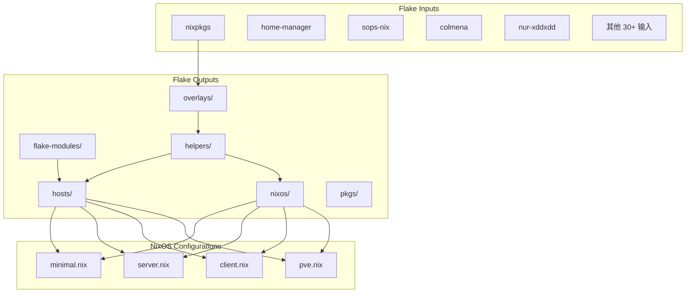
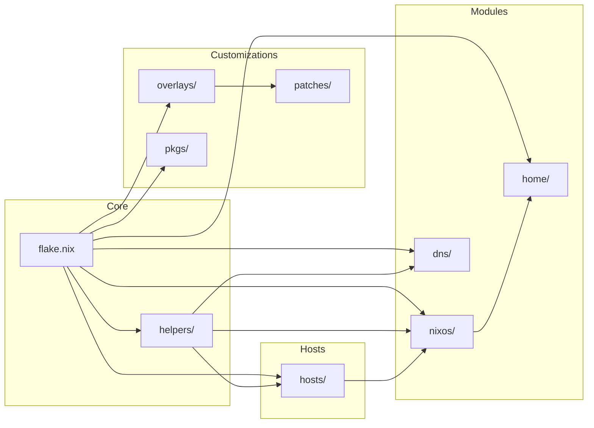

# Lan Tian's NixOS Configuration

## 项目概述

这是一个基于 Nix Flakes 的 NixOS 配置项目，用于管理多台主机的系统配置。项目采用模块化设计，支持服务器、客户端和最小化三种配置类型，集成了大量自定义包、覆盖层和补丁。

### 核心特性

- **多主机管理**：支持 x86_64-linux 和 aarch64-linux 两种架构
- **模块化设计**：通过标签系统灵活组合功能模块
- **自定义包**：包含 Rust 编写的自定义工具
- **DNS 管理**：使用 DNSControl 管理 DNS 记录
- **部署工具**：支持 Colmena 批量部署

## 目录结构

```
.
├── flake.nix              # Flake 入口文件
├── flake.lock             # Flake 锁文件
├── Makefile               # 构建命令
├── nvfetcher.toml         # 包版本管理配置
├── dns/                   # DNS 配置
├── flake-modules/         # Flake 模块
├── helpers/               # 辅助函数和常量
├── home/                  # Home Manager 配置
├── hosts/                 # 主机配置
├── nixos/                 # NixOS 模块
├── overlays/              # Nixpkgs 覆盖层
├── patches/               # 软件补丁
└── pkgs/                  # 自定义包
```

## 关键文件说明

### flake.nix

Flake 入口文件，定义了：

- **inputs**：所有外部依赖，包括 nixpkgs、home-manager、sops-nix、colmena 等 30+ 个输入
- **outputs**：使用 flake-parts 组织输出，导入 flake-modules 下的模块
- **系统支持**：x86_64-linux 和 aarch64-linux

### flake.lock

锁定所有输入的版本，确保可重现构建。

### Makefile

提供常用构建命令的快捷方式。

### nvfetcher.toml

用于管理一些非 Nixpkgs 包的版本更新。

## 主机配置说明

`hosts/` 目录包含所有主机的配置，每个主机是一个子目录，包含：

| 文件                         | 说明                                      |
| ---------------------------- | ----------------------------------------- |
| `host.nix`                   | 主机元数据（标签、IP、SSH 密钥等）        |
| `configuration.nix`          | 主配置文件                                |
| `hardware-configuration.nix` | 硬件配置（由 nixos-generate-config 生成） |

### 可用标签

| 标签          | 说明                 |
| ------------- | -------------------- |
| `server`      | 服务器配置           |
| `client`      | 客户端配置（带 GUI） |
| `dn42`        | DN42 节点            |
| `nix-builder` | Nix 远程构建节点     |
| `low-disk`    | 低磁盘空间优化       |
| `low-ram`     | 低内存优化           |
| `ipv4-only`   | 仅 IPv4              |
| `lan-access`  | 局域网访问           |
| `cuda`        | NVIDIA CUDA 支持     |

## 模块系统说明

`nixos/` 目录包含 NixOS 模块，采用分层设计：

### 配置类型

| 文件          | 说明            | 包含的模块                                                                        |
| ------------- | --------------- | --------------------------------------------------------------------------------- |
| `minimal.nix` | 最小化配置      | minimal-apps + minimal-components                                                 |
| `server.nix`  | 服务器配置      | minimal-apps + common-apps + server-apps + minimal-components + server-components |
| `client.nix`  | 客户端配置      | minimal-apps + common-apps + client-apps + minimal-components + client-components |
| `pve.nix`     | Proxmox VE 配置 | -                                                                                 |

### 模块目录

| 目录                  | 说明                                                   |
| --------------------- | ------------------------------------------------------ |
| `minimal-apps/`       | 最小化应用（geoip、nginx-proxy、rsync-server）         |
| `common-apps/`        | 通用应用                                               |
| `server-apps/`        | 服务器应用（coredns、dn42-pingfinder、iperf、bird 等） |
| `client-apps/`        | 客户端应用（firefox、steam、thunderbird、fcitx 等）    |
| `minimal-components/` | 最小化组件（boot、networking、nix、ssh 等）            |
| `server-components/`  | 服务器组件（backup、dn42、logging 等）                 |
| `client-components/`  | 客户端组件                                             |
| `hardware/`           | 硬件相关配置                                           |
| `optional-apps/`      | 可选应用                                               |
| `optional-cron-jobs/` | 可选定时任务                                           |
| `pve-components/`     | Proxmox VE 组件                                        |

## 自定义包说明

`pkgs/` 目录包含自定义 Nix 包。每个包目录包含：

- `default.nix` - Nix 构建定义
- `Cargo.toml` / `Cargo.lock` - Rust 依赖配置（适用于 Rust 包）
- `src/` - 源代码

## 覆盖层说明

`overlays/` 目录包含 Nixpkgs 覆盖层，按数字前缀排序执行。文件命名格式为 `数字前缀-描述.nix`，数字越小越先执行。

`overlays/default.nix` 会自动加载目录下所有非 `default.nix` 的 `.nix` 文件。

## 补丁说明

`patches/` 目录包含各种软件补丁：

- 根目录：通用软件补丁
- `patches/nixpkgs/`：针对 Nixpkgs 的补丁

## Flake 模块说明

`flake-modules/` 目录包含 Flake 输出模块：

| 文件/目录                  | 说明             |
| -------------------------- | ---------------- |
| `nixd.nix`                 | Nixd LSP 配置    |
| `nixos-configurations.nix` | NixOS 配置生成   |
| `nixpkgs-options.nix`      | Nixpkgs 选项配置 |
| `commands/`                | 自定义命令       |

## 其他重要组件

### helpers/ 目录

辅助函数和常量定义：

| 文件/目录          | 说明                                        |
| ------------------ | ------------------------------------------- |
| `default.nix`      | 主入口，导出所有辅助函数                    |
| `constants.nix`    | 常量定义                                    |
| `geo.nix`          | 地理位置数据                                |
| `host-options.nix` | 主机选项定义                                |
| `cities.json`      | 城市数据                                    |
| `constants/`       | 各类常量（端口、网络、区域等）              |
| `fn/`              | 辅助函数（nginx、hosts、service-harden 等） |

### dns/ 目录

DNS 配置，使用 DNSControl 管理：

| 目录/文件     | 说明         |
| ------------- | ------------ |
| `default.nix` | DNS 配置入口 |
| `core/`       | DNS 核心模块 |
| `domains/`    | 各域名配置   |

支持的 DNS 提供商：

- 注册商：DOH、Porkbun
- DNS 服务商：BIND、Cloudflare、deSEC、Gcore、HE.net

### home/ 目录

Home Manager 配置：

| 文件               | 说明                     |
| ------------------ | ------------------------ |
| `client.nix`       | 客户端 Home Manager 配置 |
| `none.nix`         | 空 Home Manager 配置     |
| `common-apps/`     | 通用应用配置             |
| `non-client-apps/` | 非客户端应用配置         |

## 操作指南

### 新增 Flake 输入

#### 步骤 1：在 flake.nix 中添加输入

在 [`flake.nix`](flake.nix) 的 `inputs` 块中添加新的输入。

**基本输入格式**：

```nix
input-name = {
  url = "github:owner/repo";
};
```

**带 follows 的输入格式**（共享依赖，避免重复下载）：

```nix
input-name = {
  url = "github:owner/repo";
  inputs.nixpkgs.follows = "nixpkgs";
  inputs.systems.follows = "systems";
};
```

**非 Flake 输入格式**：

```nix
input-name = {
  url = "https://example.com/file.tar.gz";
  flake = false;
};
```

#### 步骤 2：使用 Flake 输入

**在 Flake 模块中导入**：

在 [`flake.nix`](flake.nix:182) 的 `imports` 列表中添加：

```nix
inputs.some-flake.flakeModules.someModule
```

**在 NixOS 模块中使用**：

通过 `inputs` 参数访问，例如在 [`helpers/default.nix`](helpers/default.nix) 中 `inputs` 已作为参数传入。

**在 Overlay 中使用**：

在 [`overlays/`](overlays/) 目录下创建新的 overlay 文件，通过 `inputs` 参数访问 flake 输入。

#### 步骤 3：更新 Flake 锁

```bash
nix flake lock --update-input input-name
```

### 添加 NixOS 模块

#### 步骤 1：确定模块类型

根据模块用途选择目录：

| 模块类型   | 目录                        | 自动导入的配置          |
| ---------- | --------------------------- | ----------------------- |
| 最小化应用 | `nixos/minimal-apps/`       | minimal, server, client |
| 通用应用   | `nixos/common-apps/`        | server, client          |
| 服务器应用 | `nixos/server-apps/`        | server                  |
| 客户端应用 | `nixos/client-apps/`        | client                  |
| 最小化组件 | `nixos/minimal-components/` | minimal, server, client |
| 服务器组件 | `nixos/server-components/`  | server                  |
| 客户端组件 | `nixos/client-components/`  | client                  |

#### 步骤 2：创建模块文件

在对应目录下创建 `.nix` 文件。模块会自动被配置类型导入，无需手动注册。

自动导入机制：各配置文件（[`minimal.nix`](nixos/minimal.nix)、[`server.nix`](nixos/server.nix)、[`client.nix`](nixos/client.nix)）使用 `builtins.readDir` 自动加载对应目录下的所有 `.nix` 文件。

### 添加 Overlay

#### 步骤 1：创建 Overlay 文件

在 [`overlays/`](overlays/) 目录下创建新文件，命名格式为 `数字前缀-描述.nix`。

数字前缀决定执行顺序：

- `00-` 到 `39-`：基础配置
- `40-` 到 `59-`：包覆盖
- `60-` 到 `89-`：非 Flake 包
- `90-` 以上：优化和清理

#### 步骤 2：编写 Overlay

```nix
# overlays/50-my-overlay.nix
final: prev: {
  # 覆盖现有包
  somePackage = prev.somePackage.overrideAttrs (old: {
    # 修改属性
  });

  # 添加新包
  myPackage = final.callPackage ../pkgs/my-package { };
}
```

Overlay 会自动被 [`overlays/default.nix`](overlays/default.nix) 加载。

### 分配服务端口号

#### 端口分配机制

端口常量定义在 [`helpers/constants/ports.nix`](helpers/constants/ports.nix) 中，使用嵌套属性结构组织。

**端口范围规划**：

| 端口范围    | 用途                          |
| ----------- | ----------------------------- |
| 1-9999      | 知名服务和标准端口            |
| 10000-13999 | 自定义服务端口                |
| 30000+      | 特殊用途（如 WireGuard 转发） |

#### 步骤 1：选择合适的端口

1. 查看现有端口分配，避免冲突
2. 根据服务类型选择合适的端口范围
3. 相关服务的端口尽量相邻

#### 步骤 2：添加端口常量

在 [`helpers/constants/ports.nix`](helpers/constants/ports.nix) 的 `port` 属性集中添加：

```nix
port = {
  # ... 现有端口 ...

  # 新服务端口
  MyService = 13xxx;           # 单个端口
  MyService.API = 13xxx;       # 带子服务的端口
  MyService.UI = 13xxx;

  # 端口范围
  MyService.Start = 13xxx;
  MyService.End = 13xxx;
};
```

#### 步骤 3：在模块中使用端口

```nix
{ LT, ... }:
{
  services.myService = {
    port = LT.port.MyService;
  };
}
```

`LT` 辅助对象在模块中自动可用，包含所有常量和辅助函数。

#### 步骤 4：使用字符串格式端口

如果需要字符串格式的端口号，使用 `portStr`：

```nix
portStr.MyService  # 返回 "13xxx" 而非 13xxx
```

## 开发指南

### 常用命令

```bash
# 检查配置
nix flake check

# 构建主机配置
nix build .#nixosConfigurations.<hostname>.config.system.build.toplevel

# 部署到远程主机（使用 Colmena）
nix run .#colmena apply

# 更新 DNS 配置
nix run .#dnscontrol

# 更新 Flake 输入
nix run .#update-flake
```

### 添加新主机

1. 在 `hosts/` 目录下创建新目录
2. 创建 `host.nix` 定义主机元数据
3. 创建 `configuration.nix` 导入所需模块
4. 运行 `nixos-generate-config` 生成 `hardware-configuration.nix`

## 架构图



## 依赖关系


