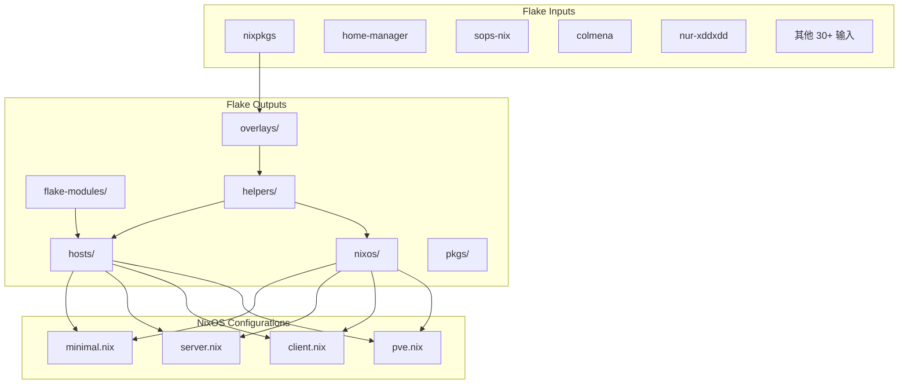
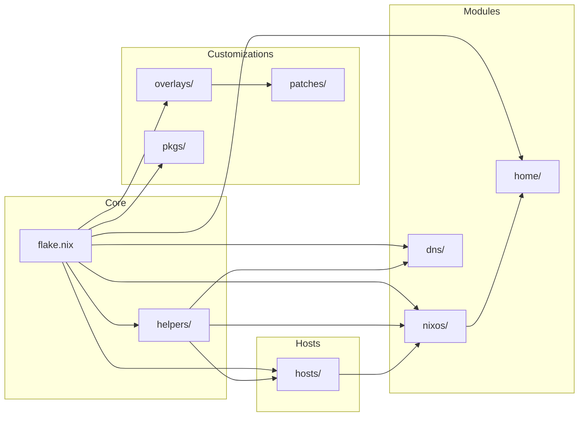

# Lan Tian's NixOS Configuration

## 项目概述

这是一个基于 Nix Flakes 的 NixOS 配置项目，用于管理多台主机的系统配置。项目采用模块化设计，支持服务器、客户端和最小化三种配置类型，集成了大量自定义包、覆盖层和补丁。

### 核心特性

- **多主机管理**：支持 x86_64-linux 和 aarch64-linux 两种架构
- **模块化设计**：通过标签系统灵活组合功能模块
- **自定义包**：包含 Rust 编写的自定义工具
- **DNS 管理**：使用 DNSControl 管理 DNS 记录
- **部署工具**：支持 Colmena 批量部署

## 目录结构

```
.
├── .github/               # GitHub Actions 工作流
├── flake.nix              # Flake 入口文件
├── flake.lock             # Flake 锁文件
├── Makefile               # 构建命令
├── nvfetcher.toml         # 包版本管理配置
├── dns/                   # DNS 配置
├── flake-modules/         # Flake 模块
├── helpers/               # 辅助函数和常量
├── home/                  # Home Manager 配置
├── hosts/                 # 主机配置
├── nixos/                 # NixOS 模块
├── overlays/              # Nixpkgs 覆盖层
├── patches/               # 软件补丁
├── pkgs/                  # 自定义包
└── tools/                 # 辅助工具脚本
```

## 关键文件说明

### flake.nix

Flake 入口文件，定义了：

- **inputs**：所有外部依赖，包括 nixpkgs、home-manager、sops-nix、colmena 等 30+ 个输入
- **outputs**：使用 flake-parts 组织输出，导入 flake-modules 下的模块
- **系统支持**：x86_64-linux 和 aarch64-linux

### flake.lock

锁定所有输入的版本，确保可重现构建。

flake.lock 的标准格式：顶层 `"root"` 键是一个字符串，指向 `"nodes"` 中根 Flake 的输入集合（节点名通常也叫 `root`）；每个节点的 `inputs` 把输入名映射到另一个锁定节点。

**注意：根 Flake 的 `nixpkgs` 输入未必对应名为 `nixpkgs` 的节点**。本仓库中根输入 `nixpkgs` 映射到节点 `nixpkgs_2`，而名为 `nixpkgs` 的节点只是其他第三方输入内部的依赖版本，**不是**系统求值用的 nixpkgs。

### 查找实际生效的 nixpkgs 版本

任何需要查阅 nixpkgs 源码（NixOS 模块、包定义、默认值）时，都**必须**先按以下流程确定实际生效的版本，禁止直接假设节点名或使用已知旧版本：

1. 解析 `flake.lock`：读取 `nodes[root].inputs.nixpkgs` 得到节点名，再读取该节点的 `locked` 字段（含 `rev`、`type`、`url`）。
2. 若根输入带 `follows` 链（如某输入 `inputs.nixpkgs.follows = "nixpkgs"`），需顺着映射继续解引用，直到得到 `locked` 非空的节点。
3. 用该 `rev` 直接从 GitHub 拉取源码，例如：`https://raw.githubusercontent.com/NixOS/nixpkgs/<rev>/nixos/modules/...`（tarball 类型输入的短 rev 同样适用于 GitHub raw）。

实例（2025 年时点）：`nodes[root].inputs.nixpkgs = "nixpkgs_2"`，对应 GitHub rev `151fa4e8ddfdd8dd25d945ad94ed54a13de9f6e4`（26.11pre tarball）。当时节点 `nixpkgs`（rev `545c226a`）与生效版本不一致：Hydra 的 `services.hydra.queueRunner` / `services.hydra-builder` 选项只存在于 `nixpkgs_2` 对应的模块中，在错误版本上查询会得出“选项不存在”的错误结论。

### Makefile

提供常用构建命令的快捷方式。

### nvfetcher.toml

用于管理一些非 Nixpkgs 包的版本更新。

## 主机配置说明

`hosts/` 目录包含所有主机的配置，每个主机是一个子目录，包含：

| 文件                         | 说明                                      |
| ---------------------------- | ----------------------------------------- |
| `host.nix`                   | 主机元数据（标签、IP、SSH 密钥等）        |
| `configuration.nix`          | 主配置文件                                |
| `hardware-configuration.nix` | 硬件配置（由 nixos-generate-config 生成） |

### 可用标签

| 标签             | 说明                                                       |
| ---------------- | ---------------------------------------------------------- |
| `client`         | 客户端配置（带 GUI）                                       |
| `cn-accel`       | 中国网络加速节点（启用 v2ray、openvpn-gameaccel）  |
| `dn42`           | DN42 节点                                                  |
| `nix-builder`    | Nix 远程构建节点                                           |
| `public-facing`  | 公网可访问节点（用于 Prometheus blackbox 监控等）          |
| `server`         | 服务器配置                                                 |
| `ipv4-only`      | 仅 IPv4                                                    |
| `ipv6-only`      | 仅 IPv6                                                    |
| `lan-access`     | 局域网访问                                                 |
| `cuda`           | NVIDIA CUDA 支持                                           |
| `low-gpu`        | 低性能 GPU 优化（禁用桌面模糊、简化 mpv 缩放）             |
| `low-ram`        | 低内存优化                                                 |

## 模块系统说明

`nixos/` 目录包含 NixOS 模块，采用分层设计：

### 配置类型

| 文件          | 说明            | 包含的模块                                                                        |
| ------------- | --------------- | --------------------------------------------------------------------------------- |
| `minimal.nix` | 最小化配置      | minimal-apps + minimal-components + minimal-modules + minimal-policies                                                 |
| `server.nix`  | 服务器配置      | minimal-apps + common-apps + server-apps + minimal-components + server-components + minimal-modules + minimal-policies |
| `client.nix`  | 客户端配置      | minimal-apps + common-apps + client-apps + minimal-components + client-components + minimal-modules + minimal-policies |
| `pve.nix`     | Proxmox VE 配置 | minimal-apps + minimal-components + pve-components + minimal-modules + minimal-policies                                       |

### 模块目录

| 目录                  | 说明                                                   |
| --------------------- | ------------------------------------------------------ |
| `minimal-apps/`       | 最小化应用（geoip、nginx-proxy、rsync-server）         |
| `common-apps/`        | 通用应用                                               |
| `server-apps/`        | 服务器应用（coredns、dn42-peerfinder、iperf、bird 等） |
| `client-apps/`        | 客户端应用（firefox、steam、thunderbird、fcitx 等）    |
| `minimal-components/` | 最小化组件（boot、networking、nix、ssh 等）            |
| `minimal-modules/`    | 可上游化模块（独立工作、默认禁用，仅添加 options）     |
| `minimal-policies/`   | 配置策略断言（assertions，检查配置正确性，自动导入到所有角色配置） |
| `server-components/`  | 服务器组件（backup、dn42、logging 等）                 |
| `client-components/`  | 客户端组件                                             |
| `pve-components/`     | Proxmox VE 组件（自动导入到 pve.nix）                  |
| `hardware/`           | 通用硬件配置片段（LVM、QEMU、NVIDIA 等，需在主机配置中手动导入） |
| `optional-apps/`      | 可选应用（部分主机使用，需在主机配置中手动导入）        |
| `optional-cron-jobs/` | 可选定时任务（部分主机使用，需在主机配置中手动导入）    |

### 策略断言说明

`nixos/minimal-policies/` 目录存放配置策略断言（assertions），用于在构建时检查配置是否符合预期约束。该目录会被 `minimal.nix`、`server.nix`、`client.nix`、`pve.nix` 等所有角色配置自动导入。

当前包含的策略：

| 文件                                  | 说明                                                          |
| ------------------------------------- | ------------------------------------------------------------- |
| `ensure-dynamicuser-correctness.nix`  | 确保自定义用户未启用 DynamicUser                              |
| `ensure-service-restart.nix`          | 确保所有 systemd 服务设置了 Restart 属性                      |
| `nginx-security.nix`                  | 确保 Nginx 虚拟主机的安全配置正确（localhost/public 访问控制） |
| `podman-ensure-autoupdate.nix`        | 确保所有 Podman 容器启用了自动更新                            |

### 防火墙选项系统

`nftables` 防火墙表 `lantian` 不再由硬编码字符串拼接，而是由 `lantian.firewall` 下的选项拼装（定义在 `nixos/minimal-components/firewall/`，含 `options.nix`、`presets.nix`、`arp.nix`）：

- `lantian.firewall.chains.<链名>.rules`：链的普通规则列表，每条规则为 `{ priority = LT.firewallPriorities.<档位>; text = "nft 语句"; }`；同优先级的连续规则可写在同一个多行 `text` 中。链的 `type`/`hook`/`priority`/`policy` 选项声明基链。
- `lantian.firewall.chains.<链名>.dnat`：结构化 DNAT 列表，每项提供 `priority`、`matches`（匹配表达式列表）、可选的 `ipv4` 和 `ipv6` 目标；每个已设置的目标各生成对应地址族的规则。与普通规则一起按优先级稳定排序；类型和生成逻辑均位于 `nixos/minimal-components/firewall/options.nix`，生成内容不附加缩进或空行。独立网络命名空间的规则不由此选项管理。
- `LT.firewallPriorities`：在 `helpers/constants/firewall-priorities.nix` 定义，仅有 `early = 100`、`preService = 200`、`service = 300`、`terminal = 400` 四个常量（基链 hook 的优先级另算）。数字较小的规则先执行，同档按定义顺序排列；新增规则应复用相应档位，不要另写数字或随意改变顺序。
- `lantian.firewall.ipsets.<集合名>`：nft 集合（`type`、`flags`、`elements`），多个模块可向同一集合追加 `elements`（如游戏加速器向 `CN_FIREWALLED_PORTS` 追加端口）。
- `lantian.firewall.presets.<名称>.enable` 及各预设自己的选项：功能开关。通用预设在 `presets.nix` 定义；服务专属规则定义在各自服务模块中（如 `openvpn-gameaccel.nix`、`open5gs`、`ocfs2.nix`、`nginx-proxy.nix`、`yggdrasil-alfis.nix`、`server-apps/coredns.nix`、`pipewire-roc-sink.nix`、`route-chain.nix`、`netns-tnl-buyvm.nix`）。`public-firewall.enable` 默认值为 `!LT.this.firewalled`（仅在非 firewalled、即公网可达的主机上默认启用，firewalled 主机需显式开启）。`public-firewall.firewalledPorts` 默认为空，由启用的 Samba、CUPS、Rsync、BIRD、Avahi、NMEA、NFS 服务模块分别追加；NFS 端口在 `services.nfs.server.enable` 时无条件追加，已无 `lantian.nfs.firewallPorts` 开关。
- 规则引用 `@INTERFACE_*` 集合时需确保 `interface-sets` 预设已启用（相关规则已用 `mkIf` 保护）。

## 自定义包说明

`pkgs/` 目录包含自定义 Nix 包。每个包目录包含：

- `default.nix` - Nix 构建定义
- `Cargo.toml` / `Cargo.lock` - Rust 依赖配置（适用于 Rust 包）
- `src/` - 源代码
- `build.rs`、`data/`、`assets/` - 构建脚本、编译期内嵌数据与运行时资产（如该包需要）

包由使用处通过 `pkgs.callPackage ../../pkgs/<名> { }` 引入（示例见 `nixos/optional-apps/pipewire-volume-control.nix`）。若包带有运行时才读取的资产，约定在 `postInstall` 中安装到 `$out/share/<pname>/`，由服务单元以参数指向该路径。

`home/client-apps/firefox/addons/` 是 Firefox 扩展包集合（仅由同目录的 firefox 配置使用，故不放在 `pkgs/`），不再依赖外部 flake 输入：`addons.json` 固定 `home/client-apps/firefox/default.nix` 所用扩展（除由 nvfetcher 跟踪的 `auto-novel-addon`）的 AMO 版本、下载 URL、SRI hash 与 `addonId`，`default.nix` 据此生成把 `.xpi` 安装到 `share/mozilla/extensions/{ec8030f7-c20a-464f-9b0e-13a3a9e97384}/<addonId>.xpi` 并带 `passthru.addonId` 的包，`update.py` 通过 AMO API 重新生成 `addons.json`。`update.py` 由 `nix run .#update-data` 自动执行。

`home/client-apps/thunderbird/addons/` 同理管理 Thunderbird 扩展（目录结构、`default.nix` 构建器与 firefox 一致）：`addons.json` 固定 8 个 ATN 扩展，`update.py` 走 ATN v4 API（`https://addons.thunderbird.net/api/v4/addons/addon/<slug>/`，文件在 `current_version.files[]` 而非 `.file`）。

Thunderbird 配置在 `home/client-apps/thunderbird/default.nix`，通过 `programs.thunderbird.profiles."ayx6omhb.default".extensions`（`isDefault = true`、`package = pkgs.thunderbird-bin`、`extensions.autoDisableScopes = 0`）安装这些扩展，并强制接管 Thunderbird 原本自行生成的 `profiles.ini`（`home.file.".thunderbird/profiles.ini".force = true`）。中文语言包不属于扩展列表：`thunderbird-bin` 不支持 `programs.thunderbird.languagePacks` 所需的 `override`，改由 `nixos/client-apps/thunderbird.nix` 的 `policies.json` 用 `RequestedLocales` + `ExtensionSettings` 管理。注意 Home Manager 以递归方式链接 profile 的 `extensions` 目录，已有的未托管 `.xpi`（如手动安装的扩展）不会被自动删除。

## 覆盖层说明

`overlays/` 目录包含 Nixpkgs 覆盖层，按数字前缀排序执行。文件命名格式为 `数字前缀-描述.nix`，数字越小越先执行。

`overlays/default.nix` 会自动加载目录下所有非 `default.nix` 的 `.nix` 文件。

## 补丁说明

`patches/` 目录包含各种软件补丁：

- 根目录：通用软件补丁
- `patches/nixpkgs/`：针对 Nixpkgs 的补丁

## Flake 模块说明

`flake-modules/` 目录包含 Flake 输出模块：

| 文件/目录                  | 说明             |
| -------------------------- | ---------------- |
| `nixd.nix`                 | Nixd LSP 配置    |
| `nixos-configurations.nix` | NixOS 配置生成   |
| `nixpkgs-options.nix`      | Nixpkgs 选项配置 |
| `commands/`                | 自定义命令       |

## 其他重要组件

### helpers/ 目录

辅助函数和常量定义：

| 文件/目录          | 说明                                        |
| ------------------ | ------------------------------------------- |
| `default.nix`      | 主入口，导出所有辅助函数                    |
| `constants.nix`    | 常量定义                                    |
| `geo.nix`          | 地理位置数据                                |
| `host-options.nix` | 主机选项定义                                |
| `cities.json`      | 城市数据                                    |
| `constants/`       | 各类常量（端口、网络、区域等）              |
| `fn/`              | 辅助函数（nginx、hosts、service-harden 等） |

### dns/ 目录

DNS 配置，使用 DNSControl 管理：

| 目录/文件     | 说明         |
| ------------- | ------------ |
| `default.nix` | DNS 配置入口 |
| `core/`       | DNS 核心模块 |
| `domains/`    | 各域名配置   |

支持的 DNS 提供商：

- 注册商：DOH、Porkbun
- DNS 服务商：BIND、Cloudflare、deSEC、Gcore、HE.net

### home/ 目录

Home Manager 配置：

| 文件               | 说明                     |
| ------------------ | ------------------------ |
| `client.nix`       | 客户端 Home Manager 配置 |
| `none.nix`         | 空 Home Manager 配置     |
| `common-apps/`     | 通用应用配置             |
| `non-client-apps/` | 非客户端应用配置         |

## 操作指南

### 新增 Flake 输入

#### 步骤 1：在 flake.nix 中添加输入

在 [`flake.nix`](flake.nix) 的 `inputs` 块中添加新的输入。

**基本输入格式**：

```nix
input-name = {
  url = "github:owner/repo";
};
```

**带 follows 的输入格式**（共享依赖，避免重复下载）：

```nix
input-name = {
  url = "github:owner/repo";
  inputs.nixpkgs.follows = "nixpkgs";
  inputs.systems.follows = "systems";
};
```

**非 Flake 输入格式**：

```nix
input-name = {
  url = "https://example.com/file.tar.gz";
  flake = false;
};
```

#### 步骤 2：使用 Flake 输入

**在 Flake 模块中导入**：

在 [`flake.nix`](flake.nix:182) 的 `imports` 列表中添加：

```nix
inputs.some-flake.flakeModules.someModule
```

**在 NixOS 模块中使用**：

通过 `inputs` 参数访问，例如在 [`helpers/default.nix`](helpers/default.nix) 中 `inputs` 已作为参数传入。

**在 Overlay 中使用**：

在 [`overlays/`](overlays/) 目录下创建新的 overlay 文件，通过 `inputs` 参数访问 flake 输入。

#### 步骤 3：更新 Flake 锁

```bash
nix flake lock --update-input input-name
```

### 添加 NixOS 模块

#### 步骤 1：确定模块类型

根据模块用途选择目录：

| 模块类型   | 目录                        | 自动导入的配置          |
| ---------- | --------------------------- | ----------------------- |
| 最小化应用 | `nixos/minimal-apps/`       | minimal, server, client |
| 通用应用   | `nixos/common-apps/`        | server, client          |
| 服务器应用 | `nixos/server-apps/`        | server                  |
| 客户端应用 | `nixos/client-apps/`        | client                  |
| 最小化组件 | `nixos/minimal-components/` | minimal, server, client |
| 可上游化模块 | `nixos/minimal-modules/`  | minimal, server, client |
| 服务器组件 | `nixos/server-components/`  | server                  |
| 客户端组件 | `nixos/client-components/`  | client                  |

#### 步骤 2：创建模块文件

在对应目录下创建 `.nix` 文件。模块会自动被配置类型导入，无需手动注册。

自动导入机制：各配置文件（[`minimal.nix`](nixos/minimal.nix)、[`server.nix`](nixos/server.nix)、[`client.nix`](nixos/client.nix)）使用 `builtins.readDir` 自动加载对应目录下的所有 `.nix` 文件。

### 添加 Overlay

#### 步骤 1：创建 Overlay 文件

在 [`overlays/`](overlays/) 目录下创建新文件，命名格式为 `数字前缀-描述.nix`。

数字前缀决定执行顺序：

- `00-` 到 `39-`：基础配置
- `40-` 到 `59-`：包覆盖
- `60-` 到 `89-`：非 Flake 包
- `90-` 以上：优化和清理

#### 步骤 2：编写 Overlay

```nix
# overlays/50-my-overlay.nix
final: prev: {
  # 覆盖现有包
  somePackage = prev.somePackage.overrideAttrs (old: {
    # 修改属性
  });

  # 添加新包
  myPackage = final.callPackage ../pkgs/my-package { };
}
```

Overlay 会自动被 [`overlays/default.nix`](overlays/default.nix) 加载。

### 分配服务端口号

#### 端口分配机制

端口常量定义在 [`helpers/constants/ports.nix`](helpers/constants/ports.nix) 中，使用嵌套属性结构组织。

**端口范围规划**：

| 端口范围    | 用途                          |
| ----------- | ----------------------------- |
| 1-9999      | 知名服务和标准端口            |
| 10000-13999 | 自定义服务端口                |
| 30000+      | 特殊用途（如 WireGuard 转发） |

#### 步骤 1：选择合适的端口

1. 查看现有端口分配，避免冲突
2. 根据服务类型选择合适的端口范围
3. 相关服务的端口尽量相邻

#### 步骤 2：添加端口常量

在 [`helpers/constants/ports.nix`](helpers/constants/ports.nix) 的 `port` 属性集中添加：

```nix
port = {
  # ... 现有端口 ...

  # 新服务端口
  MyService = 13xxx;           # 单个端口
  MyService.API = 13xxx;       # 带子服务的端口
  MyService.UI = 13xxx;

  # 端口范围
  MyService.Start = 13xxx;
  MyService.End = 13xxx;
};
```

**端口必须按端口号数值升序排列**。`port` 属性集中的每一行都要按其端口号从小到大排序，新增端口时应插入到数值正确的位置，而非简单追加到末尾。带嵌套属性的端口（如 `MyService.API`）同样按其端口号参与排序。

#### 步骤 3：在模块中使用端口

```nix
{ LT, ... }:
{
  services.myService = {
    port = LT.port.MyService;
  };
}
```

`LT` 辅助对象在模块中自动可用，包含所有常量和辅助函数。

#### 步骤 4：使用字符串格式端口

如果需要字符串格式的端口号，使用 `portStr`：

```nix
portStr.MyService  # 返回 "13xxx" 而非 13xxx
```

## 开发指南

### 常用命令

```bash
# 检查配置
nix flake check

# 构建主机配置
nix build .#nixosConfigurations.<hostname>.config.system.build.toplevel

# 部署到远程主机（使用 Colmena）
nix run .#colmena apply

# 更新 DNS 配置
nix run .#dnscontrol

# 更新 Flake 输入
nix run .#update-flake
```

### 添加新主机

1. 在 `hosts/` 目录下创建新目录
2. 创建 `host.nix` 定义主机元数据
3. 创建 `configuration.nix` 导入所需模块
4. 运行 `nixos-generate-config` 生成 `hardware-configuration.nix`

## 架构图


```mermaid
graph TB
    subgraph Flake Inputs
        nixpkgs[nixpkgs]
        home-manager[home-manager]
        agenix[sops-nix]
        colmena[colmena]
        nur-xddxdd[nur-xddxdd]
        others[其他 30+ 输入]
    end

    subgraph Flake Outputs
        flake-modules[flake-modules/]
        helpers[helpers/]
        hosts[hosts/]
        nixos[nixos/]
        overlays[overlays/]
        pkgs[pkgs/]
    end

    subgraph NixOS Configurations
        minimal[minimal.nix]
        server[server.nix]
        client[client.nix]
        pve[pve.nix]
    end

    nixpkgs --> overlays
    overlays --> helpers
    helpers --> hosts
    helpers --> nixos
    flake-modules --> hosts
    hosts --> minimal
    hosts --> server
    hosts --> client
    hosts --> pve
    nixos --> minimal
    nixos --> server
    nixos --> client
    nixos --> pve
```

## 依赖关系


```mermaid
graph LR
    subgraph Core
        flake[flake.nix]
        helpers[helpers/]
    end

    subgraph Modules
        nixos[nixos/]
        home[home/]
        dns[dns/]
    end

    subgraph Customizations
        overlays[overlays/]
        patches[patches/]
        pkgs[pkgs/]
    end

    subgraph Hosts
        hosts[hosts/]
    end

    flake --> helpers
    flake --> nixos
    flake --> home
    flake --> dns
    flake --> overlays
    flake --> pkgs
    flake --> hosts

    helpers --> nixos
    helpers --> hosts
    helpers --> dns

    overlays --> patches
    nixos --> home
    hosts --> nixos
```
